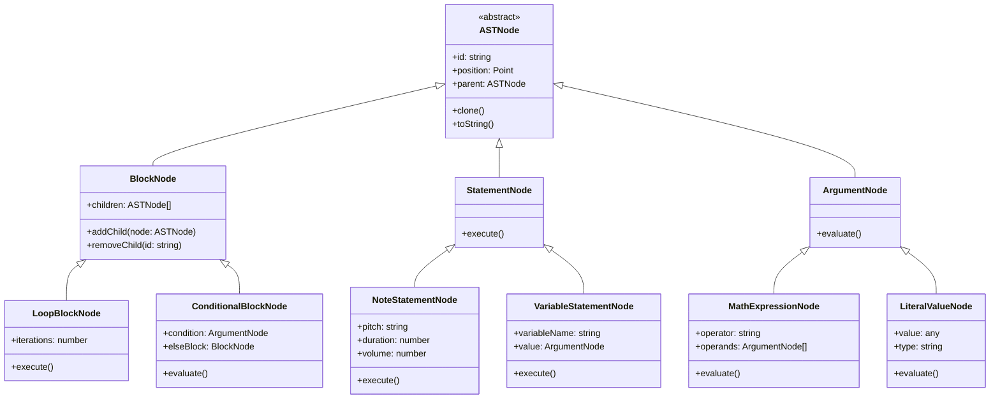
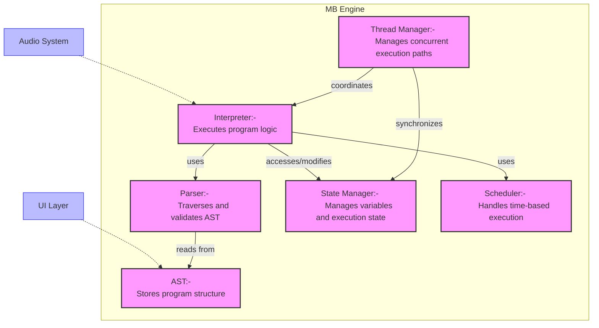
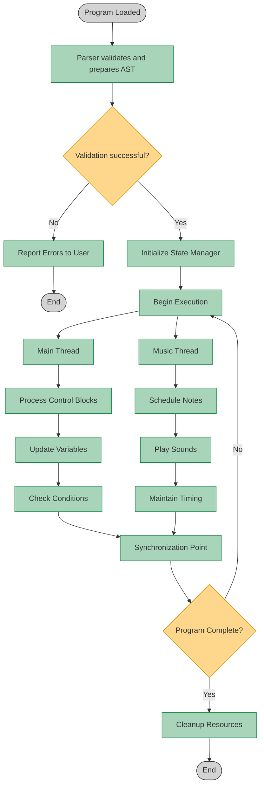
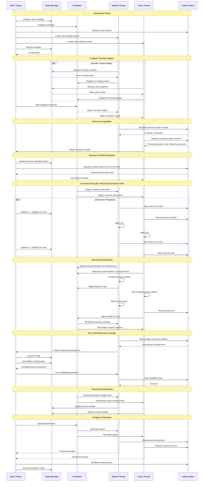

<!--markdownlint-disable-->
## AST Structure Diagram
Where to add: In the Technical Specifications section, right after introducing the "Program Representation Architecture"



## Program Engine Architecture Diagram
Where to add: At the beginning of the Implementation Plan section, before diving into components



## Execution Flow Diagram
Where to add: In the Dynamic Components section, after introducing all components



## Sample AST Node Type Definitions
Where to add: In the AST Structure Design section, after describing the node types

```typescript
/**
 * Music Blocks Program Engine - Abstract Syntax Tree
 * Core TypeScript definitions
 */

// Basic types and interfaces
export interface Position {
  x: number;
  y: number;
}

export type NodeId = string;

// Base AST Node - Abstract class for all nodes
export abstract class ASTNode {
  id: NodeId;
  position: Position;
  parent: ASTNode | null;
  
  constructor(id: NodeId, position: Position) {
    this.id = id;
    this.position = position;
    this.parent = null;
  }
  
  // Tree navigation methods
  getRoot(): ASTNode {
    return this.parent ? this.parent.getRoot() : this;
  }
  
  getAncestors(): ASTNode[] {
    const ancestors: ASTNode[] = [];
    let current = this.parent;
    
    while (current) {
      ancestors.push(current);
      current = current.parent;
    }
    
    return ancestors;
  }
  
  // Abstract methods that all nodes must implement
  abstract clone(): ASTNode;
  abstract accept<T>(visitor: NodeVisitor<T>): T;
}

// BlockNode - For control structures that contain other nodes
export class BlockNode extends ASTNode {
  children: ASTNode[];
  
  constructor(id: NodeId, position: Position) {
    super(id, position);
    this.children = [];
  }
  
  addChild(node: ASTNode): void {
    this.children.push(node);
    node.parent = this;
  }
  
  removeChild(id: NodeId): ASTNode | null {
    const index = this.children.findIndex(child => child.id === id);
    
    if (index !== -1) {
      const [removed] = this.children.splice(index, 1);
      removed.parent = null;
      return removed;
    }
    
    return null;
  }
  
  replaceChild(oldNode: ASTNode, newNode: ASTNode): boolean {
    const index = this.children.indexOf(oldNode);
    
    if (index !== -1) {
      this.children[index] = newNode;
      newNode.parent = this;
      oldNode.parent = null;
      return true;
    }
    
    return false;
  }
  
  clone(): BlockNode {
    const cloned = new BlockNode(this.id, { ...this.position });
    this.children.forEach(child => {
      const childClone = child.clone();
      cloned.addChild(childClone);
    });
    return cloned;
  }
  
  accept<T>(visitor: NodeVisitor<T>): T {
    return visitor.visitBlockNode(this);
  }
}

// StatementNode - For executable statements
export abstract class StatementNode extends ASTNode {
  constructor(id: NodeId, position: Position) {
    super(id, position);
  }
  
  // Abstract method that must be implemented by concrete statement nodes
  abstract execute(context: ExecutionContext): void;
}

// ArgumentNode - For expressions and values
export abstract class ArgumentNode extends ASTNode {
  constructor(id: NodeId, position: Position) {
    super(id, position);
  }
  
  // Abstract method that must be implemented by concrete argument nodes
  abstract evaluate(context: ExecutionContext): any;
}

// LoopBlockNode - A specialized block for repetition
export class LoopBlockNode extends BlockNode {
  iterations: ArgumentNode;
  
  constructor(id: NodeId, position: Position, iterations: ArgumentNode) {
    super(id, position);
    this.iterations = iterations;
    this.iterations.parent = this;
  }
  
  execute(context: ExecutionContext): void {
    const count = this.iterations.evaluate(context);
    
    for (let i = 0; i < count; i++) {
      context.setLoopVariable('index', i);
      
      for (const child of this.children) {
        if (child instanceof StatementNode) {
          child.execute(context);
        }
      }
    }
  }
  
  clone(): LoopBlockNode {
    const clonedIterations = this.iterations.clone() as ArgumentNode;
    const cloned = new LoopBlockNode(this.id, { ...this.position }, clonedIterations);
    
    this.children.forEach(child => {
      const childClone = child.clone();
      cloned.addChild(childClone);
    });
    
    return cloned;
  }
  
  accept<T>(visitor: NodeVisitor<T>): T {
    return visitor.visitLoopBlockNode(this);
  }
}

// NoteStatementNode - A statement that plays a musical note
export class NoteStatementNode extends StatementNode {
  pitch: ArgumentNode;
  duration: ArgumentNode;
  volume: ArgumentNode;
  
  constructor(
    id: NodeId, 
    position: Position, 
    pitch: ArgumentNode, 
    duration: ArgumentNode, 
    volume: ArgumentNode
  ) {
    super(id, position);
    this.pitch = pitch;
    this.duration = duration;
    this.volume = volume;
    
    // Set parent references
    this.pitch.parent = this;
    this.duration.parent = this;
    this.volume.parent = this;
  }
  
  execute(context: ExecutionContext): void {
    const pitchValue = this.pitch.evaluate(context);
    const durationValue = this.duration.evaluate(context);
    const volumeValue = this.volume.evaluate(context);
    
    // In a real implementation, this would invoke the audio system
    context.playNote(pitchValue, durationValue, volumeValue);
  }
  
  clone(): NoteStatementNode {
    return new NoteStatementNode(
      this.id,
      { ...this.position },
      this.pitch.clone() as ArgumentNode,
      this.duration.clone() as ArgumentNode,
      this.volume.clone() as ArgumentNode
    );
  }
  
  accept<T>(visitor: NodeVisitor<T>): T {
    return visitor.visitNoteStatementNode(this);
  }
}

// NumberLiteralNode - A literal number value
export class NumberLiteralNode extends ArgumentNode {
  value: number;
  
  constructor(id: NodeId, position: Position, value: number) {
    super(id, position);
    this.value = value;
  }
  
  evaluate(_context: ExecutionContext): number {
    return this.value;
  }
  
  clone(): NumberLiteralNode {
    return new NumberLiteralNode(this.id, { ...this.position }, this.value);
  }
  
  accept<T>(visitor: NodeVisitor<T>): T {
    return visitor.visitNumberLiteralNode(this);
  }
}

// Visitor interface for implementing the Visitor pattern
export interface NodeVisitor<T> {
  visitBlockNode(node: BlockNode): T;
  visitLoopBlockNode(node: LoopBlockNode): T;
  visitNoteStatementNode(node: NoteStatementNode): T;
  visitNumberLiteralNode(node: NumberLiteralNode): T;
  // Additional visit methods would be added for other node types
}

// Execution context interface for running the program
export interface ExecutionContext {
  getVariable(name: string): any;
  setVariable(name: string, value: any): void;
  setLoopVariable(name: string, value: any): void;
  playNote(pitch: number, duration: number, volume: number): void;
  // Additional methods for program execution would be defined here
}
```


## Concurrency Model Visualization
Where to add: In the Concurrency and Time Management section


