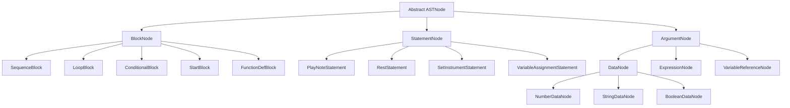
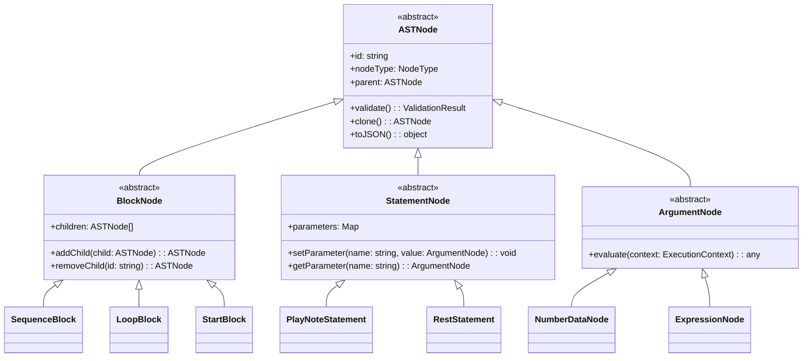
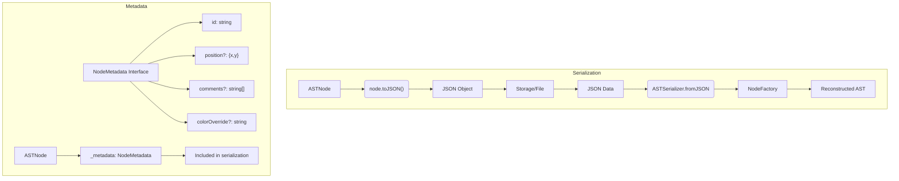
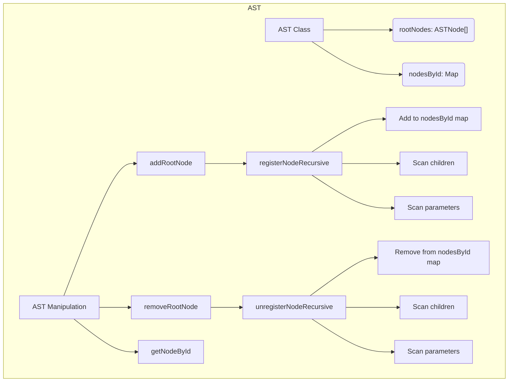
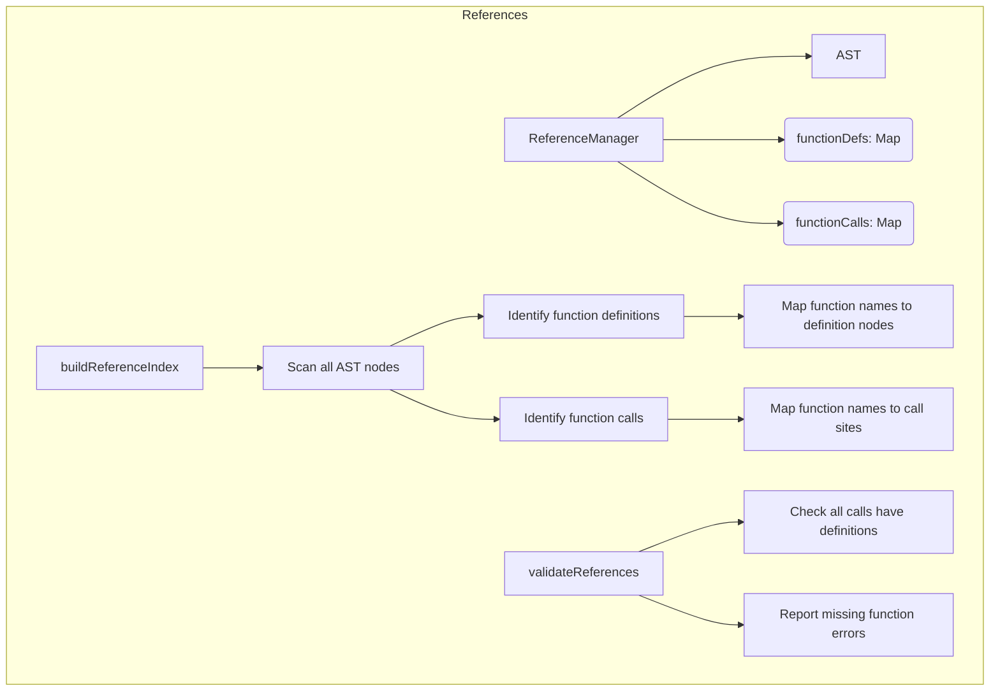
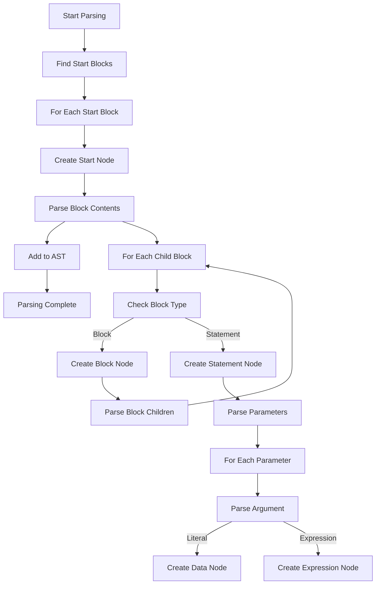
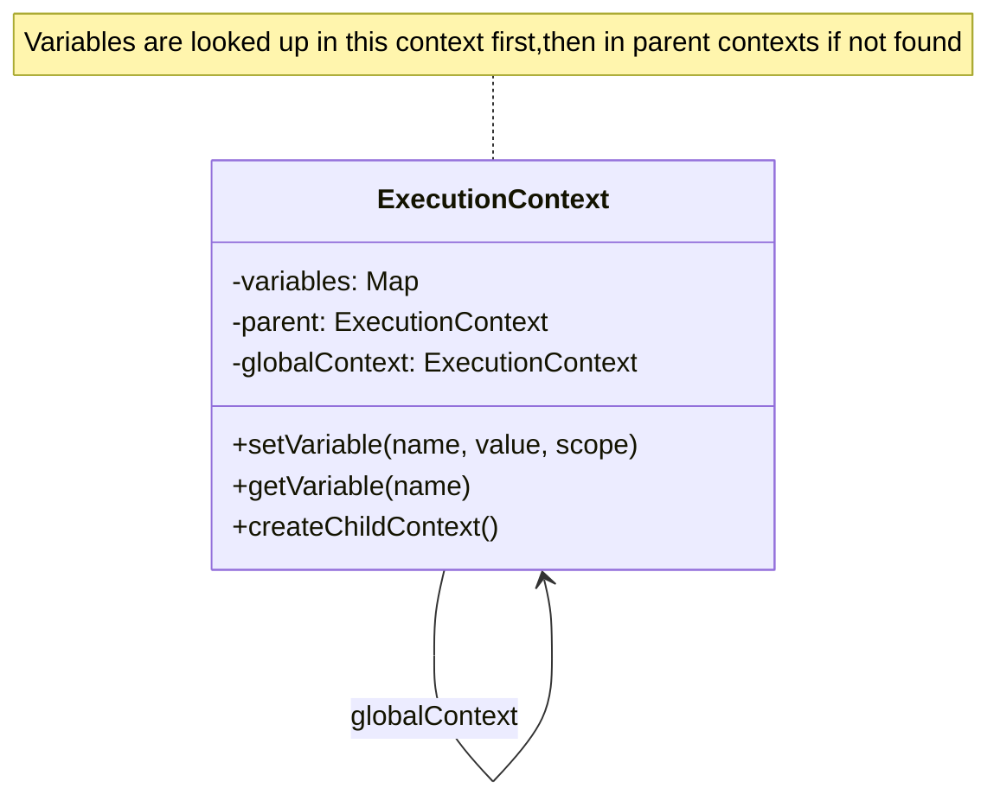
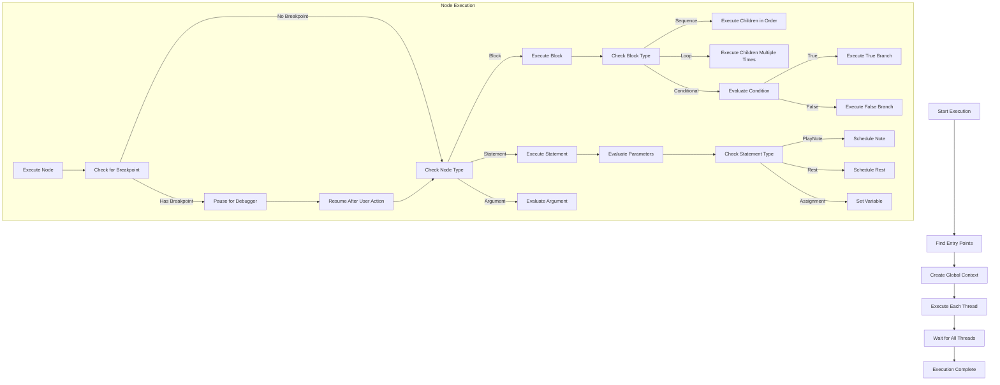
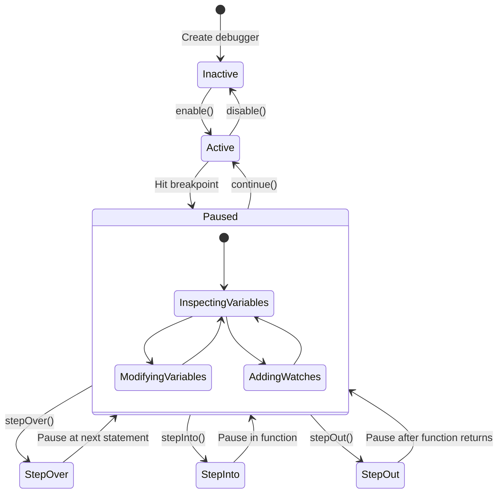

<!--markdownlint-disable-->
## Node Types

## Node Type Hierarchy

## Node Metadata and Serialization

## AST Manipulation

## Reference Management

## Parser Implementation

## State Manager

## Interpreter

## Concurrency and Time Management

```mermaid
flowchart TD
    subgraph "Thread Management"
        spawnThread[Spawn Thread] --> createThread[Create Thread Entry]
        createThread --> executeFunction[Execute Thread Function]
        executeFunction -- Success --> markComplete[Mark Thread Complete]
        executeFunction -- Error --> markError[Mark Thread Error]
        
        waitForAll[Wait for All Threads] --> checkStatus[Check Thread Status]
        checkStatus -- All Complete --> collectResults[Collect Results]
        checkStatus -- Some Running --> waitMore[Wait More]
        waitMore --> checkStatus
    end
    
    subgraph "Time Scheduling"
        scheduleNote[Schedule Note] --> calculateTiming[Calculate Note Timing]
        calculateTiming --> createOscillator[Create Audio Oscillator]
        createOscillator --> createGain[Create Gain Node]
        createGain --> connectNodes[Connect Audio Nodes]
        connectNodes --> scheduleStart[Schedule Start Time]
        scheduleStart --> scheduleStop[Schedule Stop Time]
        scheduleStop --> addToEvents[Add to Scheduled Events]
        addToEvents --> advanceTime[Advance Time Offset]
    end
    
    subgraph "Synchronization"
        thread1[Thread 1] --> access[Access Shared Resource]
        thread2[Thread 2] --> access
        access --> checkLock[Check Resource Lock]
        checkLock -- Locked --> waitUnlock[Wait for Unlock]
        waitUnlock --> checkLock
        checkLock -- Unlocked --> acquireLock[Acquire Lock]
        acquireLock --> useResource[Use Resource]
        useResource --> releaseLock[Release Lock]
    end
```

## Debugging Support
