   <!--markdownlint-disable-->
# Music Blocks 4 Program Engine - GSoC 2025 Proposal

## Table of Contents

1. [Introduction](#introduction)
2. [Terms and Concepts](#terms-and-concepts)
3. [Project Details](#project-details)
   - [Project Overview](#project-overview)
   - [Project Objectives](#project-objectives)
   - [Alignment with Music Blocks Architecture](#alignment-with-music-blocks-architecture)
   - [Critical Success Factors](#critical-success-factors)
4. [Functional Specifications](#functional-specifications)
   - [Core Programming Capabilities](#core-programming-capabilities)
   - [Technical Constraints](#technical-constraints)
5. [Technical Specifications](#technical-specifications)
   - [Program Representation Architecture](#program-representation-architecture)
   - [Execution Engine Architecture](#execution-engine-architecture)
   - [Technical Interfaces](#technical-interfaces)
   - [Error Handling Architecture](#error-handling-architecture)
6. [Implementation Plan](#implementation-plan)
   - [Static Components: Program Representation](#static-components-program-representation)
   - [Dynamic Components: Program Execution](#dynamic-components-program-execution)
   - [Key Implementation Challenges and Approaches](#key-implementation-challenges-and-approaches)
7. [Implementation Milestones](#implementation-milestones)
8. [Evaluation and Testing Strategy](#evaluation-and-testing-strategy)
9. [Deliverables](#deliverables)
10. [Implementation Methodology](#implementation-methodology)
    - [Implementation Phases](#implementation-phases)
11. [Post-GSoC Plans](#post-gsoc-plans)
    - [Immediate Post-GSoC Work](#immediate-post-gsoc-work-3-6-months)
    - [Medium-Term Contributions](#medium-term-contributions-6-12-months)
12. [Conclusion](#conclusion)

## Introduction

Music Blocks is an innovative visual programming environment designed to help students explore and learn about music, mathematics, and programming concepts through interactive experiences. Originally developed by Sugar Labs, Music Blocks empowers learners to create music through a block-based programming interface, similar to Scratch but with a focus on music creation and exploration.

The current initiative, Music Blocks v4, represents a significant leap forward in the platform's architecture. This new version aims to build upon the success of previous iterations while introducing a more modular, maintainable, and extensible design. At the heart of this redesign is the Program Engine—the core system responsible for transforming visual block arrangements into executable programs that generate music and interactive experiences.

My passion for both music and programming makes this project especially appealing. As someone who has explored music production and programming language design, I see Music Blocks as a perfect intersection of these domains. The challenge of creating an execution engine that can handle the unique requirements of musical programming—especially aspects like timing, concurrency, and real-time feedback—presents an exciting technical challenge that aligns with my skills and interests.

## Terms and Concepts

Before diving into the project details, it's important to understand the key terminology and concepts that will be referenced throughout this proposal:

- **Abstract Syntax Tree (AST)**: A hierarchical tree representation of code that captures its syntactic structure. In Music Blocks, the AST represents the logical structure of a program created with visual blocks.

- **Bricks/Blocks**: The visual programming elements that users interact with in the Music Blocks interface. These are dragged, snapped together, and configured to build programs.

- **BlockNode**: A node in the AST that represents control flow structures like loops or conditionals.

- **StatementNode**: A node in the AST that represents a single operation or instruction.

- **ArgumentNode**: A node that provides data or expressions as input to statements or blocks.

- **Parser**: The component responsible for converting the visual block arrangement into an AST structure that can be executed.

- **Interpreter**: The component that traverses the AST and executes the program logic.

- **State Manager**: Keeps track of program variables, execution state, and context during runtime.

- **Concurrency**: The ability to run multiple sections of code simultaneously, which is essential for music programming where different musical parts often need to play together.

- **Time-based Instructions**: Commands that execute over a duration rather than instantaneously (e.g., playing a note for two beats).

## Project Details

### Project Overview

The Music Blocks v4 Program Engine project focuses on developing the execution core that powers the Music Blocks platform. This involves creating a robust system for representing Music Blocks programs as Abstract Syntax Trees and implementing the components needed to execute these programs efficiently.

The current implementation in the [musicblocks-v4-lib](https://github.com/sugarlabs/musicblocks-v4-lib) repository has laid some groundwork, but significant work is needed to create a complete, performant execution engine that can handle the unique requirements of Music Blocks programming.

### Project Objectives

Based on the project description and existing PRDs, the key objectives for this GSoC project are:

1. **Refine Object-Oriented Program Syntax Constructs**:
   - Develop a comprehensive class hierarchy representing Music Blocks program elements
   - Ensure these constructs can express all required programming patterns
   - Create a flexible foundation that supports future extensions

2. **Build Abstract Syntax Tree Framework**:
   - Design and implement a robust AST representation
   - Provide utilities for manipulating and traversing the AST
   - Ensure the AST structure supports serialization/deserialization

3. **Develop Dynamic Execution Components**:
   - Create a parser to traverse AST nodes
   - Implement a state manager to track program state
   - Build an interpreter to execute expressions and instructions

4. **Address Time-based and Concurrent Execution**:
   - Design mechanisms for handling instructions that execute over time
   - Implement multi-threading capabilities for concurrent program execution
   - Ensure proper synchronization between parallel execution threads

5. **Create Comprehensive Testing Suite**:
   - Develop unit tests for all components
   - Create integration tests for the execution engine as a whole
   - Implement performance benchmarks

6. **Optimize Runtime Performance**:
   - Identify and address performance bottlenecks
   - Optimize memory usage and execution speed

### Alignment with Music Blocks Architecture

This project builds upon the current Music Blocks v4 architecture, which separates concerns into distinct modules:

1. **User Interface Layer**: The visual block programming environment
2. **Program Representation Layer**: The AST and related structures
3. **Execution Layer**: The engine that runs the program

My focus will be primarily on layers 2 and 3, ensuring they integrate smoothly with the UI layer developed by other contributors.

### Critical Success Factors

For this project to be considered successful, several key factors must be addressed:

1. **Performance Optimization for Educational Settings**
   
   Music Blocks is often used in educational environments with varying hardware capabilities. The Program Engine must perform well not only on modern hardware but also on older devices commonly found in schools. This requires careful optimization and testing on lower-end devices.

   I'll establish performance benchmarks on representative hardware configurations and optimize critical paths to ensure acceptable performance across the spectrum of target devices.

2. **Cross-Browser Compatibility**
   
   As a web-based application, Music Blocks must function consistently across different browsers. The Program Engine needs to account for browser-specific differences in JavaScript execution, timing precision, and audio handling.
   
   I'll implement feature detection and fallback mechanisms for browser-specific APIs, and establish a testing matrix that includes all major browsers (Chrome, Firefox, Safari, Edge) across different operating systems.

3. **Scalability for Complex Musical Programs**
   
   While beginning users might create simple programs, advanced users could create complex compositions with thousands of blocks. The engine architecture must scale gracefully with program complexity.
   
   I'll design the system with scalability in mind, implementing techniques like lazy evaluation, code chunking, and strategic caching to maintain performance even with very large programs.

4. **Extensibility for Future Block Types**
   
   Music Blocks continues to evolve with new block types and capabilities. The Program Engine must be designed to accommodate future extensions without requiring significant rearchitecting.
   
   I'll create an extensible plugin system for registering new block types, operations, and capabilities, ensuring that the core engine can be enhanced without modification.

## Functional Specifications

The Program Engine needs to fulfill several key functional requirements to support the Music Blocks v4 platform effectively:

### Core Programming Capabilities

1. **Block-Based Program Representation**
   - Support visual blocks that can be snapped together to form programs
   - Allow nesting of blocks to create hierarchical structures
   - Enable parameterization of blocks through input fields and connections

2. **Music Generation Functions**
   - Play individual notes with specified pitch, duration, and volume
   - Create sequences of notes to form melodies
   - Support chord creation and playback
   - Enable polyphonic music with multiple simultaneous voices

3. **Mathematical Operations**
   - Perform basic arithmetic (addition, subtraction, multiplication, division)
   - Support mathematical functions (sine, cosine, random, etc.)
   - Handle variable assignment and retrieval
   - Process mathematical expressions with operator precedence

4. **Control Flow**
   - Execute conditional logic (if/else statements)
   - Support various loop structures (repeat, while, for)
   - Enable event-based execution (when X happens, do Y)
   - Provide functions/procedures with parameter passing

5. **Concurrent Execution**
   - Run multiple program segments simultaneously
   - Synchronize execution between parallel threads
   - Manage shared resources across concurrent processes

6. **Time-Based Operations**
   - Schedule operations to occur at specific times
   - Maintain consistent timing based on musical tempo
   - Support time-dependent instructions that span multiple beats

7. **User Interaction**
   - Respond to user input during program execution
   - Provide real-time feedback on program state
   - Support debugging and stepwise execution

### Technical Constraints

The Program Engine must operate within certain technical constraints:

1. **Performance Requirements**
   - Execute programs with millisecond-level timing precision for musical applications
   - Support programs with at least 1000 blocks without noticeable lag
   - Maintain 60 fps when running with visual feedback enabled

2. **Platform Compatibility**
   - Function in modern web browsers without plugins
   - Support both desktop and mobile execution environments
   - Operate offline once loaded

3. **Integration Requirements**
   - Expose clean APIs for the UI layer to interact with
   - Provide observable program state for visualization
   - Support serialization for saving/loading programs

## Technical Specifications

Based on the functional requirements, I propose the following technical specifications for the Program Engine implementation:

### Program Representation Architecture

1. **AST Design**
   - Implement a class-based inheritance hierarchy with `ASTNode` as the base class
   - Use TypeScript interfaces to define contracts between node types
   - Create specialized node types that include:
     - `BlockNode`: Represents control structures and code blocks
     - `StatementNode`: Represents individual executable statements
     - `ArgumentNode`: Represents expressions and values used as inputs
     - `EventNode`: Represents event triggers and handlers

2. **Node Properties and Relationships**
   - Each node will maintain parent-child relationships via references
   - Nodes will include position metadata for UI integration
   - Nodes will have unique identifiers for cross-referencing
   - Type information will be embedded in nodes for runtime validation

3. **State Management Model**
   - Implement a global state container with immutable update patterns
   - Use a scoping system based on execution contexts
   - Support variable shadowing between different scopes
   - Provide transactional state updates to support undo/redo

 ##### AST Structure Diagram

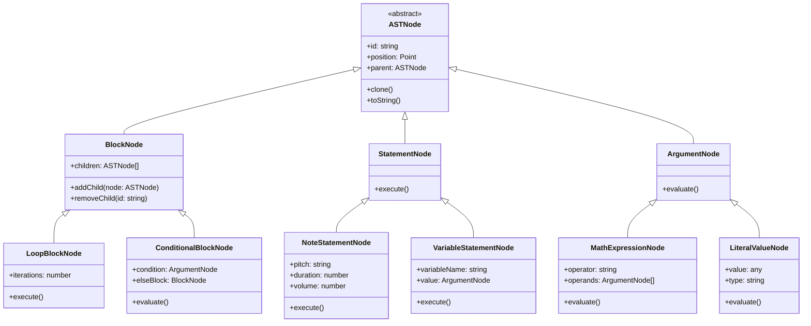

### Execution Engine Architecture

1. **Parser Design**
   - Create a recursive descent parser to traverse the AST
   - Implement visitor pattern for node type-specific processing
   - Add pre-execution validation to catch type errors early
   - Support incremental parsing for performance optimization

2. **Interpreter Implementation**
   - Use command pattern for executing different statement types
   - Implement a virtual machine model with instruction pointer
   - Create a call stack for managing function invocations
   - Build an expression evaluator using operator precedence parsing

3. **Concurrency Model**
   - Implement a cooperative multitasking system using JavaScript promises
   - Create an event loop that manages execution threads
   - Use message passing for communication between threads
   - Implement mutex-like mechanisms for critical sections

4. **Time Management System**
   - Build a scheduler based on musical beats rather than absolute time
   - Create a tempo manager that converts beats to milliseconds
   - Implement lookahead scheduling for audio timing precision
   - Use a priority queue for managing scheduled events

### Technical Interfaces

1. **External API**
   - Provide methods for program loading and execution
   - Expose hooks for execution events (start, pause, stop)
   - Create callback system for runtime notifications
   - Implement debugging interfaces for inspection and control

2. **Internal Interfaces**
   - Define clear boundaries between subsystems
   - Create abstraction layers for hardware interactions
   - Use dependency injection for service access
   - Implement observer pattern for state changes

### Error Handling Architecture

1. **Runtime Error Management**
   - Create a hierarchical error classification system
   - Implement contextual error messages with line information
   - Add recovery mechanisms for non-fatal errors
   - Include debugging helpers for common errors

2. **Validation System**
   - Implement pre-execution static analysis
   - Create runtime type checking for dynamic operations
   - Add boundary checking for array access and similar operations
   - Validate resource usage to prevent overallocation

## Implementation Plan
The implementation plan is divided into several major components that together form the complete Program Engine.

##### Program Engine Architecture Diagram
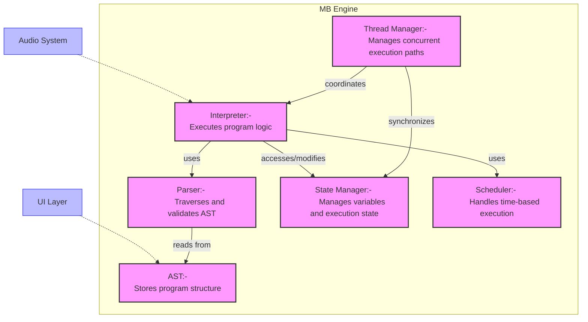

### Static Components: Program Representation

#### AST Structure Design

The foundation of the system will be a well-designed Abstract Syntax Tree (AST) structure that can represent all Music Blocks programming constructs. This includes:

1. **Base Node Types**:
   - A generic `ASTNode` base class that serves as the root for all other node types. This class will contain common properties and methods shared across different node types, ensuring a consistent and scalable structure.
   - Specialized node types for blocks, statements, and arguments. Each of these will inherit from the `ASTNode` base class and include additional properties and methods specific to their roles, providing clarity and separation of concerns.
   - Support for parent-child relationships and traversal, facilitating efficient representation of complex hierarchical structures. This includes methods for navigating to parent nodes, child nodes, and sibling nodes, making it easy to move around the AST.

```typescript
/**
 * Enum defining the fundamental node types in Music Blocks AST
 */
export enum NodeType {
  // Base categories
  BLOCK = 'block',
  STATEMENT = 'statement',
  ARGUMENT = 'argument',
  
  // Common subtypes (to be expanded)
  SEQUENCE = 'sequence',
  LOOP = 'loop',
  START = 'start',
  PLAY_NOTE = 'play_note',
  DATA_NUMBER = 'data_number',
  EXPRESSION = 'expression'
  // Additional types will be added as needed
}

/**
 * Base abstract class for all AST nodes
 */
export abstract class ASTNode {
  readonly id: string;
  readonly nodeType: NodeType;
  protected _parent: ASTNode | null = null;
  
  constructor(id: string, nodeType: NodeType) {
    this.id = id;
    this.nodeType = nodeType;
  }
  
  get parent(): ASTNode | null {
    return this._parent;
  }
  
  setParent(node: ASTNode | null): void {
    this._parent = node;
  }
  
  abstract validate(): ValidationResult;
  abstract clone(): ASTNode;
  abstract toJSON(): object;
}

// This base class will be extended with additional functionality
// as the project progresses
```

2. **Node Type Hierarchy**:
   - **BlockNodes**: Represent control structures such as loops (e.g., `for`, `while`) and conditionals (e.g., `if`, `switch`). These nodes will contain other nodes as children, forming the body of the control structure and enabling nested logic.
   - **StatementNodes**: Represent single operations such as playing a note, drawing a shape, or performing a mathematical calculation. These nodes will be the leaves of the AST and will not contain other nodes, making them straightforward to evaluate.
   - **ArgumentNodes**: Represent data values or expressions that are used as inputs to statements and blocks. These nodes will include literals (e.g., numbers, strings) and more complex expressions (e.g., arithmetic operations), allowing for dynamic and flexible code.

```typescript
/**
 * Block nodes contain other nodes and implement control flow
 */
export abstract class BlockNode extends ASTNode {
  protected _children: ASTNode[] = [];
  
  constructor(id: string, nodeType: NodeType) {
    super(id, nodeType);
  }
  
  get children(): ReadonlyArray<ASTNode> {
    return [...this._children];
  }
  
  addChild(child: ASTNode, index?: number): ASTNode {
    if (child.parent) {
      (child.parent as BlockNode).removeChild(child.id);
    }
    
    if (index !== undefined) {
      this._children.splice(index, 0, child);
    } else {
      this._children.push(child);
    }
    
    child.setParent(this);
    return child;
  }
  
  removeChild(id: string): ASTNode | undefined {
    const index = this._children.findIndex(child => child.id === id);
    if (index === -1) return undefined;
    
    const child = this._children[index];
    this._children.splice(index, 1);
    child.setParent(null);
    return child;
  }
}

/**
 * Statement nodes represent individual operations
 */
export abstract class StatementNode extends ASTNode {
  protected _parameters: Map<string, ArgumentNode> = new Map();
  
  constructor(id: string, nodeType: NodeType) {
    super(id, nodeType);
  }
  
  setParameter(name: string, value: ArgumentNode): void {
    if (value.parent) {
      // Handle removing from previous parent
    }
    
    this._parameters.set(name, value);
    value.setParent(this);
  }
  
  getParameter(name: string): ArgumentNode | undefined {
    return this._parameters.get(name);
  }
}

/**
 * Argument nodes represent values or expressions
 */
export abstract class ArgumentNode extends ASTNode {
  constructor(id: string, nodeType: NodeType) {
    super(id, nodeType);
  }
  
  abstract evaluate(context: ExecutionContext): any;
}

// Additional specialized node classes will be implemented to handle
// specific Music Blocks constructs such as loops, conditionals, and
// musical operations.
```

3. **Node Metadata and Serialization**:
   - Support for storing metadata such as position (for graphical representation), color (for UI rendering), and other attributes relevant to the Music Blocks environment. This ensures that the AST can be used both for execution and visualization.
   - Serialization to/from JSON to enable saving the AST to a file and loading it back. This is crucial for persisting user projects and sharing them between different instances of the application, providing a seamless user experience.
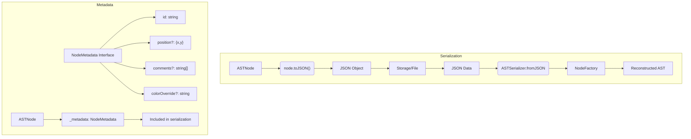

#### Program Building Utilities

To support the creation and manipulation of AST structures, we will develop a set of utilities:

1. **Node Creation Utilities**:
   - Factory methods for creating different node types. These methods will ensure that nodes are created with all necessary properties initialized, helping maintain consistency across the AST and reducing the likelihood of errors.
   - Validation logic for ensuring that nodes meet expected constraints. This includes checking that nodes are connected correctly and that required properties are set, providing early feedback to users and developers.

2. **AST Manipulation**:
   - Methods for adding, removing, and modifying nodes within the AST. These methods will handle the intricacies of maintaining parent-child relationships and updating references as nodes are moved, making it easy to edit and refactor the AST.
   - Utilities for restructuring parts of the AST, such as moving a subtree from one location to another or merging multiple subtrees. This allows for complex transformations and optimizations, enabling more sophisticated programming constructs.

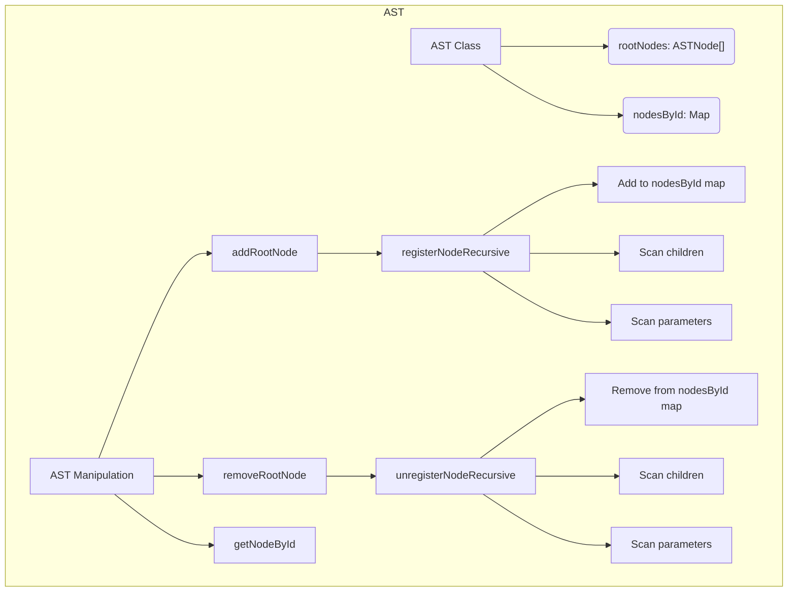

3. **Reference Management**:
   - Handling references between different parts of the AST, such as variable references, function calls, and event handlers. This ensures that the AST remains consistent and that changes to one part of the tree are reflected elsewhere.
   - Maintaining consistency when nodes are added or removed, ensuring that references are updated appropriately to prevent broken links. This is essential for preventing bugs and ensuring the reliability of the system.
   
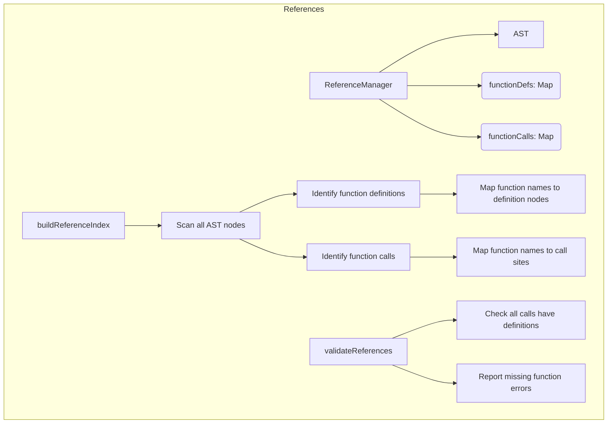

### Dynamic Components: Program Execution

#### Parser Implementation

The parser will be responsible for traversing the AST and preparing it for execution:

1. **Traversal Logic**:
   - Methods for systematically visiting nodes in the AST. This will include support for different traversal orders (e.g., pre-order, post-order) to accommodate various use cases and provide flexibility in how the AST is processed.
   - Mechanisms for invoking callbacks or executing specific logic at each node during traversal. This allows for custom processing and analysis of the AST, enabling a wide range of applications.

2. **Validation**:
   - Type checking for expressions and arguments to ensure that operations are performed on compatible types. This helps catch errors early and provides clear feedback to users.
   - Semantic validation of program structure to detect logical errors, such as using undefined variables or incorrect function signatures. This ensures that the program behaves as expected and prevents runtime errors.

3. **Optimization**:
   - Basic optimizations such as constant folding (evaluating constant expressions at compile time) to improve runtime performance. This reduces the computational load and makes the program more efficient.
   - Identification of parallelizable sections to enable concurrent execution and improve efficiency. This takes advantage of modern multi-core processors and improves overall performance.

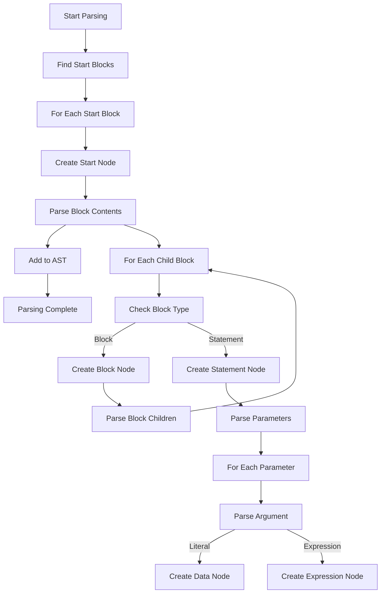

#### State Manager

The state manager will track the program state during execution:

1. **Variable Management**:
   - Storage and retrieval of variables, supporting different data types and ensuring type safety. This provides a robust and flexible way to manage program state.
   - Support for different scopes (e.g., global, local, block) to manage variable lifetimes and visibility. This allows for modular and encapsulated code, improving maintainability.

2. **Execution Context**:
   - Tracking the current execution state, including the current instruction pointer, call stack, and scope stack. This provides a clear and accurate representation of the program's execution.
   - Managing stack frames for function calls, including parameter passing, local variables, and return values. This ensures that function calls are handled correctly and efficiently.

3. **Resource Management**:
   - Handling shared resources such as audio channels, graphical contexts, and external devices. This ensures that resources are used efficiently and prevents conflicts.
   - Preventing race conditions in concurrent execution by implementing synchronization mechanisms. This ensures that the program behaves correctly even in a multi-threaded environment.

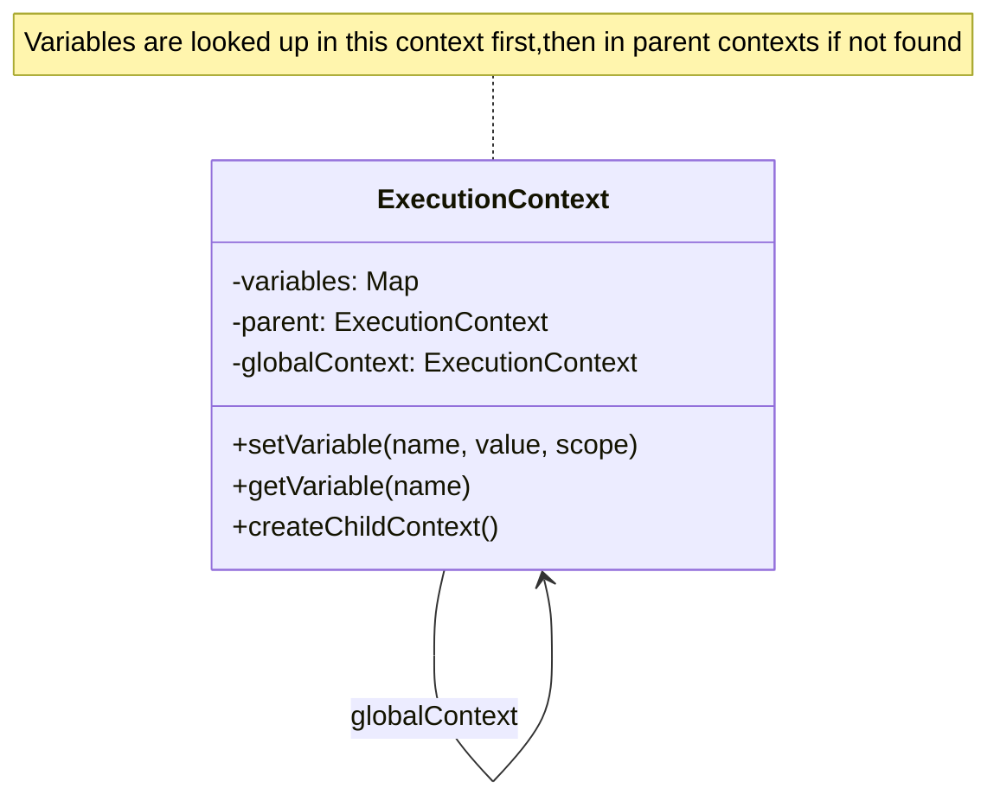

#### Interpreter

The interpreter will execute the program logic:

1. **Expression Evaluation**:
   - Evaluating mathematical expressions, including arithmetic, logical, and comparison operators. This provides the core computational capabilities of the system.
   - Handling function calls, including built-in functions and user-defined functions. This enables modular and reusable code.
   - Processing logical operators and short-circuit evaluation. This ensures that logical expressions are evaluated correctly and efficiently.

2. **Statement Execution**:
   - Executing individual statements, such as playing a note, drawing a shape, or updating a variable. This provides the core functionality of the system.
   - Calling appropriate handlers for different statement types, ensuring that each statement is executed correctly. This provides a flexible and extensible execution model.

3. **Control Flow**:
   - Managing loops, conditionals, and other control structures. This includes handling loop initialization, condition checking, and iteration, providing a robust and flexible control flow mechanism.
   - Handling break, continue, and return statements to control the flow of execution. This provides powerful control flow capabilities and enables complex logic.

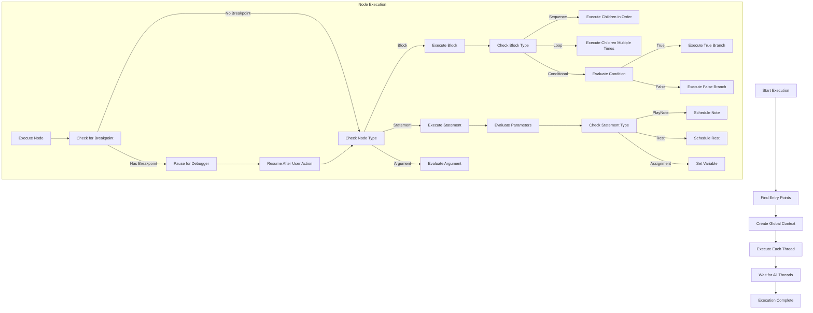

#### Concurrency and Time Management

A particularly challenging aspect of the project will be handling Music Blocks' concurrency and time-based execution requirements:

1. **Concurrency Model**:
   - Implementation of parallel execution threads to allow multiple parts of the program to run simultaneously. This improves performance and responsiveness.
   - Synchronization between threads to ensure correct execution order and prevent conflicts. This ensures that the program behaves correctly even in a multi-threaded environment.
   - Handling shared resources and state, including mechanisms for locking and resource allocation. This ensures that resources are used efficiently and prevents conflicts.

2. **Time-based Execution**:
   - Scheduling notes and other time-dependent actions to ensure precise timing. This is essential for creating accurate and synchronized musical compositions.
   - Managing tempo and timing to synchronize different musical parts and maintain rhythm. This ensures that the music is played correctly and consistently.
   - Ensuring synchronization between different musical parts, such as aligning tracks and coordinating events. This ensures that the music is played correctly and consistently.

3. **Event Handling**:
   - Processing events that might influence execution, such as user input, external signals, or timed triggers. This provides a flexible and responsive execution model.
   - Supporting event-driven programming patterns, allowing the program to respond to events in a flexible and efficient manner. This enables powerful and interactive applications.
```mermaid
flowchart TD
    subgraph "Thread Management"
        spawnThread[Spawn Thread] --> createThread[Create Thread Entry]
        createThread --> executeFunction[Execute Thread Function]
        executeFunction -- Success --> markComplete[Mark Thread Complete]
        executeFunction -- Error --> markError[Mark Thread Error]
        
        waitForAll[Wait for All Threads] --> checkStatus[Check Thread Status]
        checkStatus -- All Complete --> collectResults[Collect Results]
        checkStatus -- Some Running --> waitMore[Wait More]
        waitMore --> checkStatus
    end
    
    subgraph "Time Scheduling"
        scheduleNote[Schedule Note] --> calculateTiming[Calculate Note Timing]
        calculateTiming --> createOscillator[Create Audio Oscillator]
        createOscillator --> createGain[Create Gain Node]
        createGain --> connectNodes[Connect Audio Nodes]
        connectNodes --> scheduleStart[Schedule Start Time]
        scheduleStart --> scheduleStop[Schedule Stop Time]
        scheduleStop --> addToEvents[Add to Scheduled Events]
        addToEvents --> advanceTime[Advance Time Offset]
    end
    
    subgraph "Synchronization"
        thread1[Thread 1] --> access[Access Shared Resource]
        thread2[Thread 2] --> access
        access --> checkLock[Check Resource Lock]
        checkLock -- Locked --> waitUnlock[Wait for Unlock]
        waitUnlock --> checkLock
        checkLock -- Unlocked --> acquireLock[Acquire Lock]
        acquireLock --> useResource[Use Resource]
        useResource --> releaseLock[Release Lock]
    end
```

#### Concurrency Model Visualization

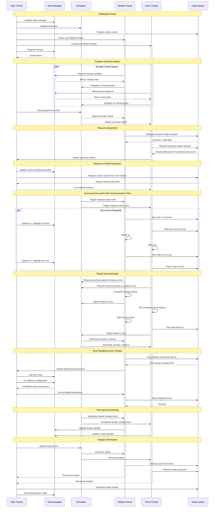


#### Debugging Support

To aid development and user experience, the engine will include comprehensive debugging capabilities:

1. **Error Handling**:
   - Detailed error reporting, including error messages, stack traces, and context information. This provides clear and actionable feedback to users and developers.
   - Recovery from non-fatal errors, allowing the program to continue execution where possible. This improves robustness and user experience.

2. **Execution Inspection**:
   - Support for breakpoints to pause execution at specific points and inspect the program state. This provides powerful debugging capabilities and helps identify and fix issues.
   - Step-by-step execution to observe the behavior of the program and identify issues. This provides a clear and detailed understanding of the program's execution.
   - Variable inspection during pauses to examine the values of variables and understand the program state. This provides clear and actionable feedback to users and developers.

3. **Logging and Monitoring**:
   - Performance monitoring to track execution time, resource usage, and other metrics. This provides valuable insights into the program's performance and helps identify bottlenecks.
   - Execution state logging to record the sequence of executed instructions and state changes for later analysis. This provides a detailed and accurate record of the program's execution, helping identify and fix issues.

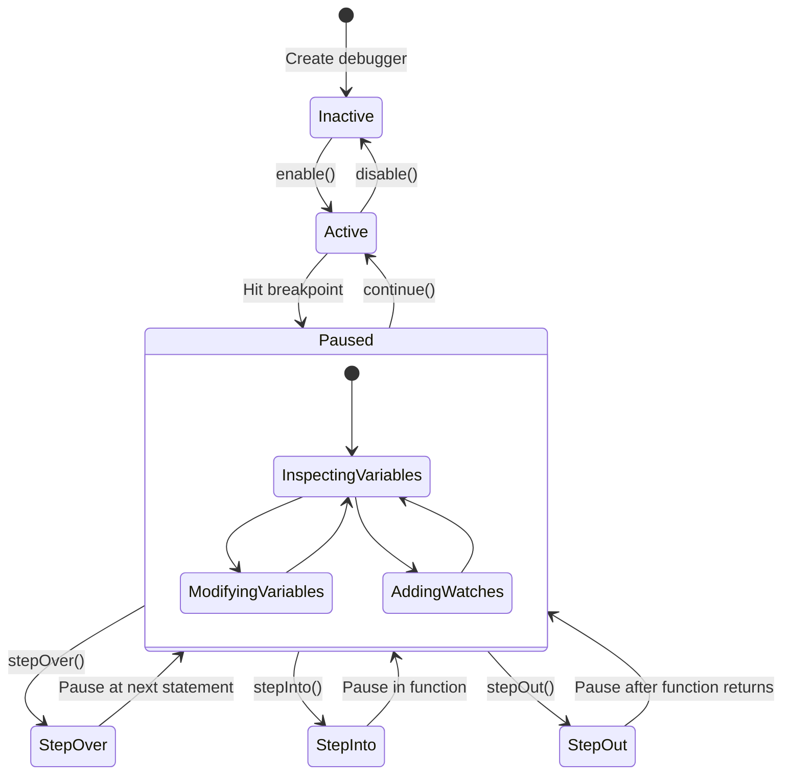

### Execution Flow Diagram
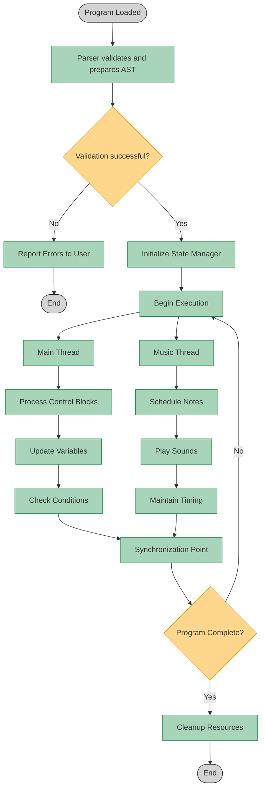

### Key Implementation Challenges and Approaches

While developing the Program Engine, I anticipate several challenging aspects that will require careful consideration:

#### Challenge 1: Real-time Timing Precision

Music programming demands millisecond-level timing precision for note playback. Browser JavaScript environments aren't designed primarily for real-time applications, which creates challenges for maintaining precise timing.

**My Approach**: I'll implement a hybrid scheduling system that combines lookahead scheduling with dynamic adjustment. The system will schedule audio events several hundred milliseconds in advance to buffer against JavaScript's timing inconsistencies, while continuously monitoring and adjusting for drift. I'll also investigate using the Web Audio API's precise timing capabilities as a timing reference rather than relying solely on setTimeout/setInterval.

#### Challenge 2: Memory Management for Long-Running Programs

Music compositions can run for extended periods, potentially leading to memory leaks or excessive garbage collection that could interrupt audio playback.

**My Approach**: I'll implement a memory pooling strategy for frequently created and destroyed objects (like note events). Additionally, I'll establish automated memory profiling during development to identify retention patterns and implement a cleanup system that reclaims resources from completed execution branches while preserving active state.

#### Challenge 3: Balancing Abstraction with Performance

Creating an elegant object-oriented representation of the program constructs might introduce performance overhead through excessive indirection and object creation.

**My Approach**: I'll use TypeScript's structural typing to create performant "view" abstractions over simpler data structures. Where performance is critical, I'll implement specialized fast paths that bypass some abstraction layers. All performance-critical sections will be benchmarked against simpler implementations to ensure abstractions don't introduce unacceptable overhead.

#### Challenge 4: Ensuring Deterministic Execution

For educational purposes, it's important that programs execute deterministically across different environments and runs, but concurrency introduces potential non-determinism.

**My Approach**: I'll implement a deterministic scheduling algorithm for concurrent operations, ensuring that parallel paths execute in a consistent order across runs. The engine will use a seeded random number generator for any stochastic operations, allowing reproducible results when needed for educational examples.

## Deliverables

By the end of the GSoC period, I plan to deliver the following:

1. **Complete Program Engine Implementation**:
   - Full implementation of all static components (AST, Node Types, etc.)
   - Full implementation of all dynamic components (Parser, Interpreter, etc.)
   - Integration with the overall Music Blocks v4 architecture

2. **Comprehensive Test Suite**:
   - Unit tests for all components
   - Integration tests for the full execution flow
   - Performance benchmarks

3. **Documentation**:
   - Technical documentation describing the engine's architecture
   - API documentation for all public interfaces
   - Usage examples and tutorials

4. **Example Programs**:
   - A collection of sample Music Blocks programs that demonstrate the engine's capabilities
   - Programs that specifically test edge cases and performance limits

## Implementation Methodology

My approach to implementing the Program Engine will follow these methodological principles:

### 1. Iterative Development

I'll focus on building the system incrementally, starting with the core components and gradually adding more complex features. This approach will allow for regular feedback and adjustments throughout the development process.

### 2. Test-Driven Development

For each component, I'll begin by writing tests that define the expected behavior. This will ensure that the implementation meets requirements and will facilitate future refactoring without introducing regressions.

### 3. Performance-First Design

Given the real-time nature of music applications, performance considerations will be factored into the design from the beginning, rather than treated as an afterthought.

### 4. Collaborative Approach

I'll work closely with the project mentors and other contributors to ensure my implementation aligns with the broader vision for Music Blocks v4.

### Implementation Phases

The implementation will proceed through these phases:

#### Phase 1: Core Static Components
- Develop base AST node classes
- Implement node type hierarchy
- Create basic AST manipulation utilities

#### Phase 2: Basic Execution
- Create simple parser for sequential execution
- Build initial state manager
- Implement interpreter for basic operations

#### Phase 3: Advanced Execution Features
- Add support for control structures (loops, conditionals)
- Implement function calls and subroutines
- Develop error handling and reporting

#### Phase 4: Concurrency and Time Management
- Implement parallel execution threads
- Develop time scheduling system
- Create synchronization mechanisms

#### Phase 5: Optimization and Integration
- Perform performance optimizations
- Integrate with UI components
- Complete comprehensive testing

## Implementation Milestones

To ensure measurable progress throughout the project, I've defined the following detailed milestones. Each milestone represents a significant achievement in the development process and includes specific deliverables and evaluation criteria.

### Milestone 1: Core AST Framework (Weeks 1-3)
**Objective**: Create the foundational classes for program representation

**Deliverables**:
- Complete `ASTNode` base class with core functionality
- Implemented hierarchy of node types (Block, Statement, Argument)
- Working serialization/deserialization for AST structures
- Comprehensive unit test suite for all node types

**Evaluation Criteria**:
- All tests passing with >90% code coverage
- Ability to construct and manipulate complex AST structures
- Successful serialization of AST to JSON and back without data loss
- Code review approval from mentor

### Milestone 2: Parsing and State Management (Weeks 4-6)
**Objective**: Build the systems for traversing ASTs and managing program state

**Deliverables**:
- Parser implementation with visitor pattern support
- State manager with variable scope handling
- Type validation system for expressions
- Test suite for parser and state manager

**Evaluation Criteria**:
- Parser correctly traverses all node types without errors
- State manager properly handles variable assignment and retrieval
- Type validation correctly identifies errors in expressions
- Performance benchmarks showing parsing of large programs

### Milestone 3: Basic Interpreter (Weeks 7-8)
**Objective**: Create the core execution system for sequential programs

**Deliverables**:
- Expression evaluator for mathematical operations
- Command executor for basic statements
- Control flow handlers for conditionals and loops
- Integration tests with sample programs

**Evaluation Criteria**:
- Correct execution of mathematical expressions with proper precedence
- Accurate handling of control structures like if/else and loops
- Successful execution of sample programs with expected outputs
- Detailed execution traces for debugging

### Milestone 4: Concurrency and Timing (Weeks 9-10)
**Objective**: Implement advanced execution features for musical programming

**Deliverables**:
- Thread management system for parallel execution
- Scheduler for time-based operations
- Synchronization mechanisms between threads
- Music-specific timing utilities

**Evaluation Criteria**:
- Demonstration of multiple threads executing simultaneously
- Accurate timing of scheduled events within 10ms precision
- Proper synchronization between parallel execution paths
- Performance analysis showing efficient resource usage

### Milestone 5: Debugging and Optimization (Weeks 11-12)
**Objective**: Finalize the engine with debugging tools and performance improvements

**Deliverables**:
- Step-through debugging capabilities
- Comprehensive error reporting system
- Performance optimizations for identified bottlenecks
- Complete API documentation and usage examples

**Evaluation Criteria**:
- Debugger successfully pauses and resumes execution
- Error messages provide actionable information
- Performance improvements demonstrated through benchmarks
- Documentation covers all public APIs with examples

## Evaluation and Testing Strategy

To ensure the Program Engine meets the requirements and operates correctly, I'll implement a comprehensive testing strategy:

### Unit Testing

I'll create unit tests for each component of the system, focusing on:

- **AST Node Tests**: Verify that each node type functions correctly in isolation
- **Parser Tests**: Ensure the parser correctly traverses different AST structures
- **State Manager Tests**: Confirm that variable management works across different scopes
- **Interpreter Tests**: Validate that expressions and statements execute as expected
- **Concurrency Tests**: Verify that parallel execution works correctly

For unit testing, I'll use Jest with TypeScript support, aiming for >90% code coverage.

### Integration Testing

Integration tests will verify that the components work together correctly:

- **End-to-End Execution Tests**: Running complete programs through the engine
- **Cross-Component Tests**: Testing interactions between the parser, state manager, and interpreter
- **Edge Case Tests**: Verifying behavior with complex or unusual program structures

### Performance Testing

Given the real-time nature of music applications, performance testing is crucial:

- **Benchmarking**: Measuring execution time for common operations
- **Memory Profiling**: Analyzing memory usage during execution
- **Load Testing**: Evaluating performance with large programs

I'll establish baseline performance metrics early in development and regularly compare against them to catch regressions.

### User Acceptance Testing

Working with the broader Music Blocks community, I'll:

- Create sample programs that demonstrate typical usage patterns
- Collect feedback on the engine's behavior and performance
- Iterate based on user experience reports

This approach ensures the engine not only meets technical requirements but also serves the needs of actual users.

## Post-GSoC Plans

My commitment to Music Blocks extends well beyond the GSoC period. I've identified specific areas where I plan to contribute after the program concludes:

### Immediate Post-GSoC Work (3-6 months)

1. **Bug Fixes and Stability**
   - Address issues discovered during wider community testing
   - Implement additional edge case handling based on real-world usage
   - Conduct monthly performance audits to identify and resolve regressions

2. **Documentation and Knowledge Transfer**
   - Create a comprehensive technical guide to the Program Engine architecture
   - Record video walkthroughs of the codebase for future contributors
   - Develop a troubleshooting guide for common issues

3. **Education Integration Support**
   - Work with educators to create lesson plans that utilize Music Blocks v4
   - Develop a starter kit of example programs for classroom use
   - Create documentation specifically targeted at teachers with limited programming background

### Medium-Term Contributions (6-12 months)

1. **Advanced Feature Development**
   - Implement a just-in-time compilation system for frequently executed code blocks
   - Create a visual debugging/tracing tool that shows program execution in real-time
   - Develop an optimization system that can suggest improvements to user programs

2. **Community Building Activities**
   - Organize monthly virtual contributor meetups to attract new developers
   - Create and maintain a dedicated forum for Music Blocks developers
   - Develop a mentorship program for new contributors

3. **Integration with Other Educational Tools**
   - Build connectors to allow Music Blocks to interact with other Sugar Labs projects
   - Develop export capabilities to standard music formats (MIDI, MusicXML)
   - Create integration points with common classroom management systems

This isn't just a list of good intentions—I'm making a concrete commitment to remain an active contributor to Music Blocks. My experience with both education and music technology has shown me the transformative potential of tools like Music Blocks, and I'm passionate about helping this project reach its full potential as an educational platform.

## Conclusion

The Music Blocks v4 Program Engine represents a challenging and exciting opportunity to build a core system that will power creative musical exploration for students around the world. The project demands technical excellence across multiple domains—from abstract syntax trees and interpreters to concurrent programming and real-time audio scheduling.

I'm confident that my background in TypeScript, object-oriented programming, and program execution systems positions me well to tackle this challenge. More importantly, I'm deeply passionate about both the technical aspects of this project and its educational mission.

By building a robust, performant, and maintainable Program Engine, we can ensure that Music Blocks v4 provides an engaging and accessible platform for exploring the intersections of music, mathematics, and programming. I'm excited about the opportunity to contribute to this important educational tool and look forward to working with the Sugar Labs team to bring this vision to reality.

Thank you for considering my proposal. I look forward to discussing it further and addressing any questions you may have.